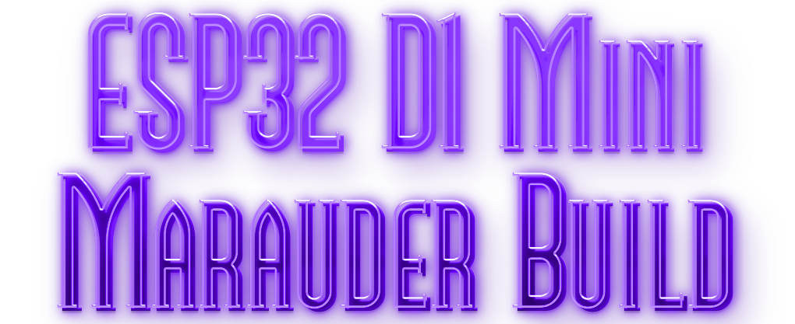

 

## 🌟 Flash Tool Under Construction as of 04/14/24 🌟

<b>Thought I'd make it easy for those wanting to try out "Wifi Marauder" on the esp32 D1 mini (Purple) module.</b> Flash tool located at bottom of repo.
 
This flash tool install version 13.8 of wifi Marauder. I'm working on updating the tool to the latest version and will update when the bugs are fixed.</b> 

### More info about "Wifi Marauder" can be located <a href="https://github.com/justcallmekoko/ESP32Marauder">HERE</a>.  

 
<b>I have followed <a href="https://www.reddit.com/r/flipperzero/comments/16eru8g/comment/kpfxvoi/?utm_source=share&utm_medium=web3x&utm_name=web3xcss&utm_term=1&utm_content=share_button">THIS</a> tutorial for building and I'm using a pcb prototyping board to build it all on.   I'm doing the sd card breakout version. If you read the reddit post by Ant966 at the bottom they have a diagram showing wiring.</b>
<b>I am also in the process of designing a case to house this in and will share files along with build process soon.</b>

 

## Pics of build 
Coming soon...

    

 

## Simple Flash Method
1. Use the <a href=https://atomnft.github.io/ESP32-D1-Mini-Marauder-Build/flash0.html>ESP32 D1 Mini Flash Tool</a> in google chrome to flash the project onto ESP32 (Purple s2 mini)

  
